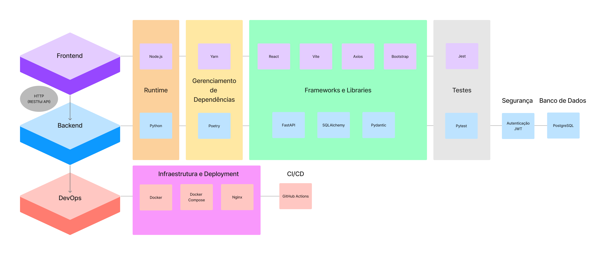
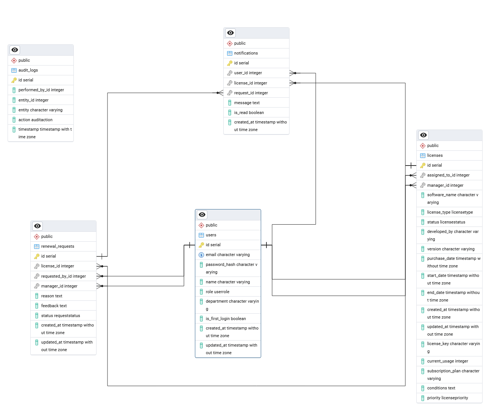

# 💻 Key-Vault

<div align="center" style="padding-top: 20px;">
  
</div>

## ✨ Introdução

Desenvolvido como parte da disciplina de Projeto Integrador V: Análise de Soluções Integradas para Organizações.

Este projeto tem como objetivo desenvolver um sistema de gerenciamento de licenças de software para uma empresa. O sistema permite registrar e acompanhar informações sobre licenças adquiridas, origem, vencimentos, quem está usando e quem são os responsáveis pelas renovações. Com essa ferramenta, a empresa pode otimizar o uso das licenças e garantir conformidade com os contratos.

> [Landing Page](https://grupo9-piv.github.io/Key-Vault/)

<div align="center">
<p>
    
     
    <a href="https://github.com/Grupo9-PIV/Key-Vault/commits/main/">
    
    </a>
</p>
<p>
    
</p>
</div>

## 📚 Funcionalidades Principais

- ✅ Cadastro e listagem de licenças de software
- 📊 Detalhamento de cada licença
- ⚠️ Controle de status e envio de notificações
- 👥 Acompanhamento do número de usuários
- 👤 Listagem e gerenciamento de usuários
- 🔐 Autenticação segura via tokens JWT
- 🔍 Pesquisa e ordenação de registros

## 💪 Tecnologias Utilizadas

<div id="tech-stack" align="center">



<hr>


<hr>

</div>

### Backend

- **FastAPI** - Framework para criação da API
- **SQLAlchemy** - ORM para interação com o banco de dados
- **Pydantic** - Validação de dados
- **JWT** - Autenticação segura

### Frontend

- **React + Vite** - Desenvolvimento da interface
- **Axios** - Consumo da API
- **Bootstrap** - Estilização

### Infraestrutura

- **Docker** - Contêinerização do ambiente
- **Nginx** - Proxy reverso
- **GitHub Actions** - CI/CD para automação de deploy

## 🎨 Layout

O layout da aplicação está disponível no Figma:

[](https://www.figma.com/design/M0nKLCKLdElRlMthmnS0bM/PROJETO-INTEGRADOR-V?t=qFffvOjE9HZJZCY9-1)

## 🎲 Banco de Dados

O SGBD escolhido foi o PostgreSQL, ideal para aplicações que requerem alta conformidade com padrões SQL, extensibilidade, suporte a dados complexos e alta confiabilidade.

Abaixo se encontra um diagrama que descreve todas as entidades e relacionamentos definidas nos `models` da aplicação.



## ⚙️ Instalação e Execução

### ⚡ Requisitos

- [Python 3.13.0](https://www.python.org)
- [Node.js 23.2.0](https://nodejs.org/pt)
- [Docker](https://www.docker.com/) (recomendado para ambiente produtivo)

### ✨ Configuração

- Clone o repositório

  ```bash
  git clone git@github.com:Grupo9-PIV/Key-Vault.git
  ```

- Crie um arquivo .env dentro da pasta `deploy` com as seguintes variáveis de ambiente (substitua valores conforme necessário):

  ```env
    # ✨ Frontend
    VITE_API_BASE_URL=/api                                              # Endpoint base para requisições HTTP à API

    # 🔒 Backend
    DATABASE_URL=postgresql+psycopg://admin:admin@db:5432/KEY_VAULT     # URL do PostgreSQL
    SECRET_KEY=sua-chave-secreta                                        # Chave para tokens JWT
    ALGORITHM=HS256                                                     # Algoritmo de criptografia
    ACCESS_TOKEN_EXPIRE_MINUTES=30                                      # Tempo de expiração do token (minutos)
    ENVIRONMENT=production                                              # Ambiente (production/development)
    CORS_ALLOWED_ORIGINS=http://localhost,http://localhost:80           # Permite a comunicação entre os serviços

    # 🐘 PostgreSQL
    POSTGRES_USER=admin                                                 # Usuário do banco de dados
    POSTGRES_PASSWORD=admin                                             # Senha do banco de dados
    PGUSER=admin                                                        # Igual ao POSTGRES_USER
    POSTGRES_HOST=db                                                    # Host do PostgreSQL
    POSTGRES_PORT=5432                                                  # Porta do PostgreSQL
    POSTGRES_DB=KEY_VAULT                                               # Nome do banco de dados
    TZ=America/Sao_Paulo                                                # Fuso horário

    # 🛠️ pgAdmin
    PGADMIN_DEFAULT_EMAIL=admin@pgadmin.com                             # Email de acesso ao pgAdmin
    PGADMIN_DEFAULT_PASSWORD=admin                                      # Senha do pgAdmin
  ```

### 🚀 Execução

Dentro do diretório de `deploy`, execute o Docker Compose

```bash
docker compose up -d
```

## 👥 Contribuição

<div align="center" style="padding-left: 25%;">
    <table style="width: 100%; border-collapse: collapse; text-align: center;">
    <tr>
        <td style="padding: 20px; border: 1px solid #ddd; vertical-align: middle;">
            
            <a href="https://github.com/jvitor-alol" target="_blank"><p>jvitor-alol</p></a>
        </td>
        <td style="padding: 20px; border: 1px solid #ddd; vertical-align: middle;">
            
            <a href="https://github.com/Lynn-Noob" target="_blank"><p>Lynn-Noob</p></a>
        </td>
        <td style="padding: 20px; border: 1px solid #ddd; vertical-align: middle;">
            
            <a href="https://github.com/Guipmaru" target="_blank"><p>Guipmaru</p></a>
        </td>
    </tr>
    <tr>
         <td style="padding: 20px; border: 1px solid #ddd; vertical-align: middle;">
            
            <a href="https://github.com/J1R429" target="_blank"><p>J1R429</p></a>
        </td>
        <td style="padding: 20px; border: 1px solid #ddd; vertical-align: middle;">
            
            <a href="https://github.com/macedoabelelias" target="_blank"><p>macedoabelelias</p></a>
        </td>
        <td style="padding: 20px; border: 1px solid #ddd; vertical-align: middle;">
            
            <a href="https://github.com/wbelhome" target="_blank"><p>wbelhome</p></a>
        </td>
  </table>
</div>

## ⚖️ Licença

Este projeto é distribuído sob a licença MIT. Consulte o arquivo `LICENSE` para mais detalhes.

[](https://opensource.org/licenses/MIT)
